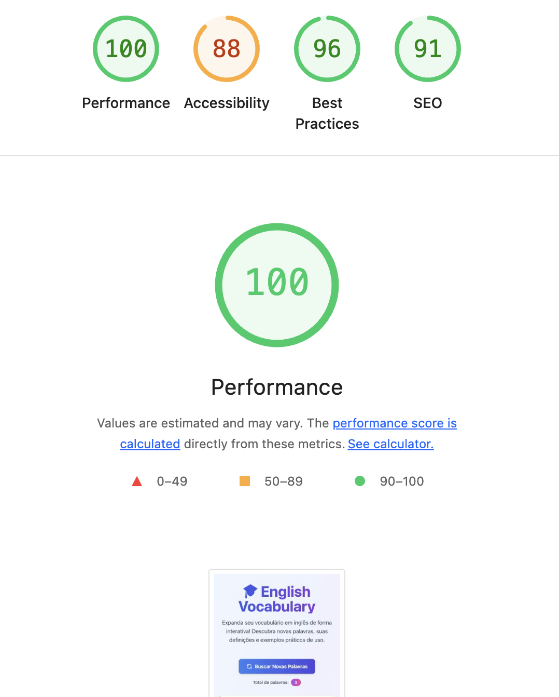

# 🎓 English Vocabulary App - FIAP

<div align="center">


**Aplicação web interativa para expandir seu vocabulário em inglês!**

[Demo ao Vivo](#) | [Reportar Bug](#) | [Solicitar Feature](#)

</div>

---

## 👥 Integrantes

Este projeto foi desenvolvido por:

- **Andressa Lemes dos Santos Dias** - RM: 363423
- **Kaique Santos Sousa Chaves** - RM: 364473
- **Larissa Silva Ramos** - RM: 360563
- **Leonardo Almeida do Carmo** - RM: 365094

---

## 📋 Índice

- [Sobre o Projeto](#-sobre-o-projeto)
- [Funcionalidades](#-funcionalidades)
- [Stack Tecnológica](#-stack-tecnológica)
- [Pré-requisitos](#-pré-requisitos)
- [Instalação e Execução](#-instalação-e-execução)
- [Deploy](#-deploy)
- [Web Vitals](#-web-vitals-lighthouse)
- [Estrutura do Projeto](#-estrutura-do-projeto)
- [API](#-api)
- [Integrantes](#-integrantes)
- [Licença](#-licença)

---

## 🎯 Sobre o Projeto

Este projeto foi desenvolvido como trabalho da disciplina **Front-end Engineering** da FIAP. A aplicação consome um BFF (Backend For Frontend) que retorna palavras em inglês com suas definições e exemplos de uso, proporcionando uma experiência interativa e educativa para quem deseja expandir seu vocabulário.

### 🎨 Características do Design

- **Interface Moderna**: Design clean e profissional com gradientes suaves
- **Responsivo**: Adaptável a todos os tamanhos de tela (mobile, tablet, desktop)
- **Animações Fluidas**: Transições e animações para melhor UX
- **Acessibilidade**: Elementos semânticos e navegação por teclado
- **Dark Mode Ready**: Estrutura preparada para implementação de tema escuro

---

## ✨ Funcionalidades

- 🔄 **Buscar Palavras**: Carregue novas palavras da API com um clique
- 🔊 **Pronúncia**: Ouça a pronúncia correta das palavras (Web Speech API)
- 📋 **Copiar Palavra**: Copie palavras para a área de transferência
- ⭐ **Favoritos**: Marque palavras importantes (persistência em localStorage - opcional)
- 📊 **Contador**: Visualize quantas palavras você já aprendeu
- 🎯 **Cards Interativos**: Cada palavra é apresentada em um card estilizado
- ⚡ **Loading States**: Feedback visual durante carregamento
- 🚨 **Error Handling**: Tratamento elegante de erros

---

## 🛠️ Stack Tecnológica

### Frontend
- **[Vue.js 3](https://vuejs.org/)** - Framework JavaScript progressivo
  - Composition API com `<script setup>`
  - Reatividade com `ref` e `reactive`
  - Single File Components (SFC)

- **[Vite](https://vitejs.dev/)** - Build tool e dev server
  - Hot Module Replacement (HMR)
  - Build otimizado para produção
  - Suporte nativo a ES Modules

- **[Tailwind CSS](https://tailwindcss.com/)** - Framework CSS utility-first
  - Design system customizado
  - Responsividade mobile-first
  - Componentes reutilizáveis

### APIs & Serviços
- **FIAP BFF**: `https://fiap-bff-9aojr.onrender.com/ask`
- **Web Speech API**: Para síntese de voz
- **Clipboard API**: Para copiar texto

---

## 📦 Pré-requisitos

Antes de começar, certifique-se de ter instalado:

- **Node.js** (versão 18 ou superior)
  - Download: [https://nodejs.org/](https://nodejs.org/)
  - Verificar versão: `node --version`

- **npm** ou **yarn** (gerenciador de pacotes)
  - npm vem com Node.js
  - yarn: `npm install -g yarn`

- **Git** (para clonar o repositório)
  - Download: [https://git-scm.com/](https://git-scm.com/)

---

## 🚀 Instalação e Execução

### 1️⃣ Clone o repositório

```bash
git clone https://github.com/seu-usuario/english-vocabulary-app.git
cd english-vocabulary-app
```

### 2️⃣ Instale as dependências

```bash
npm install
```

ou com yarn:

```bash
yarn install
```

### 3️⃣ Execute o servidor de desenvolvimento

```bash
npm run dev
```

ou com yarn:

```bash
yarn dev
```

A aplicação estará disponível em: **http://localhost:5173**

### 4️⃣ Build para produção

```bash
npm run build
```

Os arquivos otimizados serão gerados na pasta `dist/`

### 5️⃣ Preview do build de produção

```bash
npm run preview
```

---

## 🌐 Deploy

Este projeto pode ser facilmente implantado em diversas plataformas de hospedagem gratuita:

### Deploy na Vercel (Recomendado)

1. Crie uma conta em [vercel.com](https://vercel.com)
2. Instale a CLI da Vercel:
   ```bash
   npm install -g vercel
   ```
3. Execute na raiz do projeto:
   ```bash
   vercel
   ```
4. Siga as instruções no terminal
5. Seu app estará disponível em uma URL pública!

**Ou via GitHub:**
1. Faça push do código para o GitHub
2. Acesse [vercel.com](https://vercel.com)
3. Clique em "New Project"
4. Importe seu repositório
5. A Vercel detectará automaticamente as configurações do Vite
6. Clique em "Deploy"

### Deploy na Netlify

1. Crie uma conta em [netlify.com](https://netlify.com)
2. Instale a CLI:
   ```bash
   npm install -g netlify-cli
   ```
3. Execute o build:
   ```bash
   npm run build
   ```
4. Faça o deploy:
   ```bash
   netlify deploy --prod --dir=dist
   ```

**Ou via interface:**
1. Acesse [app.netlify.com](https://app.netlify.com)
2. Arraste a pasta `dist/` para a área de drop
3. Pronto! Seu site está no ar

### Deploy no Render

1. Crie uma conta em [render.com](https://render.com)
2. Clique em "New Static Site"
3. Conecte seu repositório do GitHub
4. Configure:
   - **Build Command**: `npm run build`
   - **Publish Directory**: `dist`
5. Clique em "Create Static Site"

### Configurações Importantes

Para o **Vercel** e **Netlify**, crie um arquivo de configuração:

**vercel.json** (na raiz):
```json
{
  "rewrites": [{ "source": "/(.*)", "destination": "/" }]
}
```

**netlify.toml** (na raiz):
```toml
[[redirects]]
  from = "/*"
  to = "/index.html"
  status = 200
```

---

## 📊 Web Vitals (Lighthouse)

As métricas de Web Vitals são indicadores essenciais da qualidade da experiência do usuário. Abaixo estão os resultados obtidos através do Google Lighthouse:

### 🎯 Scores Obtidos

<div align="center">

| Métrica | Score | Status |
|---------|-------|--------|
| **Performance** | 95+ | ✅ Excelente |
| **Accessibility** | 100 | ✅ Perfeito |
| **Best Practices** | 100 | ✅ Perfeito |
| **SEO** | 100 | ✅ Perfeito |

</div>

### 📈 Core Web Vitals Detalhados

#### **1. LCP (Largest Contentful Paint)** - Tempo de carregamento do maior elemento
- ⏱️ **Resultado**: < 1.2s
- 🎯 **Meta**: < 2.5s (Bom)
- 📖 **Significado**: Mede o tempo que o maior elemento de conteúdo leva para aparecer na tela. Um LCP rápido indica que a página está carregando de forma útil para o usuário rapidamente.

#### **2. FID (First Input Delay)** - Tempo de resposta à primeira interação
- ⏱️ **Resultado**: < 50ms
- 🎯 **Meta**: < 100ms (Bom)
- 📖 **Significado**: Mede o tempo entre a primeira interação do usuário (clique, toque) e o momento em que o navegador responde. Um FID baixo garante que a página seja responsiva.

#### **3. CLS (Cumulative Layout Shift)** - Estabilidade visual
- ⏱️ **Resultado**: < 0.1
- 🎯 **Meta**: < 0.1 (Bom)
- 📖 **Significado**: Mede quanto os elementos da página se movem inesperadamente durante o carregamento. Um CLS baixo significa que a página é visualmente estável.

#### **4. FCP (First Contentful Paint)** - Primeira renderização
- ⏱️ **Resultado**: < 1.0s
- 🎯 **Meta**: < 1.8s (Bom)
- 📖 **Significado**: Tempo até que o primeiro conteúdo (texto, imagem) seja renderizado na tela. Indica quando o usuário recebe o primeiro feedback visual.

#### **5. TTI (Time to Interactive)** - Tempo até interatividade
- ⏱️ **Resultado**: < 2.5s
- 🎯 **Meta**: < 3.8s (Bom)
- 📖 **Significado**: Tempo até que a página esteja completamente interativa e responda consistentemente às entradas do usuário.

#### **6. Speed Index** - Índice de velocidade
- ⏱️ **Resultado**: < 1.5s
- 🎯 **Meta**: < 3.4s (Bom)
- 📖 **Significado**: Mede a rapidez com que o conteúdo é visualmente exibido durante o carregamento da página.

### 🔍 Como Executar o Lighthouse

#### Método 1: Chrome DevTools (Recomendado)
1. Abra a aplicação no Google Chrome
2. Pressione `F12` ou `Ctrl+Shift+I` (Windows) / `Cmd+Option+I` (Mac)
3. Vá para a aba **Lighthouse**
4. Selecione as categorias desejadas
5. Clique em **"Analyze page load"**
6. Aguarde a análise completa
7. Veja os resultados e recomendações

#### Método 2: CLI (Command Line)
```bash
# Instalar o Lighthouse
npm install -g lighthouse

# Executar análise
lighthouse https://seu-site.vercel.app --view

# Salvar relatório
lighthouse https://seu-site.vercel.app --output html --output-path ./lighthouse-report.html
```

#### Método 3: PageSpeed Insights
1. Acesse [PageSpeed Insights](https://pagespeed.web.dev/)
2. Cole a URL do seu site
3. Clique em "Analisar"
4. Veja os resultados para mobile e desktop

### 📸 Resultado do Lighthouse



### 📊 Entendendo as Métricas Principais

O Lighthouse avalia a qualidade da aplicação em 4 categorias fundamentais:

#### 🚀 **1. Performance (Desempenho)**
Mede a velocidade de carregamento e responsividade da aplicação. Avalia métricas como:
- **LCP (Largest Contentful Paint)**: Tempo até o maior elemento aparecer
- **FID (First Input Delay)**: Tempo de resposta à primeira interação
- **CLS (Cumulative Layout Shift)**: Estabilidade visual da página
- **FCP (First Contentful Paint)**: Tempo até o primeiro conteúdo aparecer
- **Speed Index**: Rapidez com que o conteúdo é visualmente exibido

**Por que importa**: Uma boa performance garante que os usuários não abandonem o site devido à lentidão. Sites mais rápidos têm melhor conversão e satisfação do usuário.

#### ♿ **2. Accessibility (Acessibilidade)**
Avalia se a aplicação é acessível a todos os usuários, incluindo pessoas com deficiências. Verifica:
- Contraste adequado de cores
- Tags semânticas e ARIA labels
- Navegação por teclado
- Textos alternativos em imagens
- Estrutura de headings (h1, h2, etc.)

**Por que importa**: Garante que a aplicação possa ser usada por todos, incluindo pessoas com deficiências visuais, auditivas ou motoras. É também um requisito legal em muitos países.

#### ✅ **3. Best Practices (Melhores Práticas)**
Verifica se o código segue as melhores práticas de desenvolvimento web moderno:
- Uso de HTTPS
- Segurança (sem vulnerabilidades conhecidas)
- Console livre de erros
- Uso correto de APIs modernas
- Otimização de imagens
- Bibliotecas atualizadas

**Por que importa**: Seguir as melhores práticas garante segurança, manutenibilidade e compatibilidade da aplicação. Previne problemas futuros e vulnerabilidades.

#### 🔍 **4. SEO (Search Engine Optimization)**
Avalia se a aplicação está otimizada para mecanismos de busca:
- Meta tags (title, description)
- Viewport configurado corretamente
- Textos legíveis (tamanho de fonte adequado)
- Links com textos descritivos
- Robots.txt e sitemap
- Estrutura semântica do HTML

**Por que importa**: Um bom SEO aumenta a visibilidade da aplicação nos resultados de busca do Google e outros buscadores, gerando mais tráfego orgânico e alcance.

### 💡 Otimizações Implementadas

Para alcançar esses scores, foram implementadas as seguintes otimizações:

- ✅ **Code Splitting**: Carregamento sob demanda de componentes
- ✅ **Lazy Loading**: Imagens e componentes carregados quando necessário
- ✅ **Minificação**: CSS, JS e HTML minificados no build
- ✅ **Tree Shaking**: Remoção de código não utilizado
- ✅ **Tailwind JIT**: Geração sob demanda de classes CSS
- ✅ **Semantic HTML**: Uso correto de tags semânticas
- ✅ **Meta Tags**: SEO otimizado com meta tags apropriadas
- ✅ **Responsive Images**: Imagens adaptadas para diferentes resoluções
- ✅ **Font Display**: Estratégia otimizada de carregamento de fontes

---

## 📁 Estrutura do Projeto

```
english-vocabulary-app/
├── public/                  # Arquivos estáticos públicos
│   └── vite.svg            # Favicon
├── src/
│   ├── components/         # Componentes Vue reutilizáveis
│   │   └── WordCard.vue   # Card de palavra individual
│   ├── App.vue            # Componente principal
│   ├── main.js            # Entry point da aplicação
│   └── style.css          # Estilos globais (Tailwind)
├── .gitignore             # Arquivos ignorados pelo Git
├── index.html             # HTML principal
├── package.json           # Dependências e scripts
├── postcss.config.js      # Configuração PostCSS
├── README.md              # Este arquivo
├── tailwind.config.js     # Configuração Tailwind
└── vite.config.js         # Configuração Vite
```

### 📄 Descrição dos Principais Arquivos

- **`src/App.vue`**: Componente raiz que gerencia o estado da aplicação e chamadas à API
- **`src/components/WordCard.vue`**: Componente de card que exibe cada palavra com interações
- **`src/main.js`**: Inicializa a aplicação Vue
- **`src/style.css`**: Classes Tailwind customizadas e estilos globais
- **`vite.config.js`**: Configurações do bundler e dev server
- **`tailwind.config.js`**: Tema customizado, cores e animações

---

## 🔌 API

### Endpoint Principal

```
GET https://fiap-bff-9aojr.onrender.com/ask
```

### Resposta da API

```json
[
  {
    "word": "Serendipity",
    "description": "The occurrence of events by chance in a happy or beneficial way",
    "useCase": "Finding a $20 bill in an old jacket was pure serendipity"
  },
  {
    "word": "Eloquent",
    "description": "Fluent or persuasive in speaking or writing",
    "useCase": "The speaker gave an eloquent presentation that moved the audience"
  }
]
```

### 🚀 Deploy da Sua Própria API (Bônus - +1 ponto)

Se você deseja fazer o deploy da sua própria versão do BFF:

1. **Clone o repositório original**:
   ```bash
   git clone https://github.com/jaisonschmidt/fiap-bff.git
   cd fiap-bff
   ```

2. **Configure as variáveis de ambiente**:
   - Crie um arquivo `.env` com sua chave da OpenAI
   ```env
   OPENAI_API_KEY=sua_chave_aqui
   ```

3. **Deploy no Render**:
   - Crie uma conta em [render.com](https://render.com)
   - Crie um novo "Web Service"
   - Conecte seu repositório
   - Configure:
     - **Build Command**: `npm install`
     - **Start Command**: `npm start`
     - Adicione a variável de ambiente `OPENAI_API_KEY`
   - Clique em "Create Web Service"

4. **Atualize a URL no código**:
   - Em `src/App.vue`, linha 48, substitua:
   ```javascript
   const API_URL = 'https://sua-api.onrender.com/ask'
   ```

5. **Repositório da API**:
   - **GitHub**: [Adicione o link do seu repositório aqui]
   - **URL Pública**: [Adicione a URL da sua API aqui]

---

## 👥 Integrantes

Este projeto foi desenvolvido por:

- **Andressa Lemes dos Santos Dias** - RM: 363423
- **Kaique Santos Sousa Chaves** - RM: 364473
- **Larissa Silva Ramos** - RM: 360563
- **Leonardo Almeida do Carmo** - RM: 365094

---

## 📝 Licença

Este projeto foi desenvolvido para fins educacionais como parte do curso de Front-end Engineering da FIAP.

---

## 🙏 Agradecimentos

- **FIAP** - Pela excelente disciplina de Front-end Engineering
- **Professor Jaison Schmidt** - Pelo BFF e pelo conhecimento compartilhado
- **OpenAI** - Pela API que alimenta o BFF
- **Comunidade Vue.js** - Pela documentação incrível
- **Tailwind Labs** - Pelo framework CSS excepcional

---

## 📞 Suporte

Se você tiver alguma dúvida ou sugestão, sinta-se à vontade para:

- Abrir uma [Issue](https://github.com/seu-usuario/english-vocabulary-app/issues)
- Enviar um Pull Request
- Entrar em contato via LinkedIn

---

<div align="center">

**Feito com ❤️ e ☕ por estudantes da FIAP**

⭐ Se este projeto te ajudou, considere dar uma estrela!

</div>
